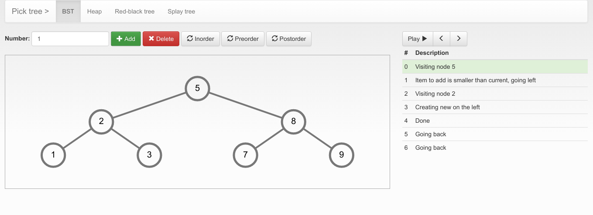

This project is a tree visualization tool, written as a base of my engineering thesis (2015).

* only frontend, Angular 1.4, jQuery, D3 without module bundler (it wasn't needed then)
* lots of data structure manipulation, which is pretty cumbersome in JS
* some :) hacks here and there to keep it working, some uninspected TODOs
* few abandoned branches with unfinished Red-Black tree deletion and failed TypeScript rewrite
* Jasmine tests, cause TDD is great for implementing algorithms

